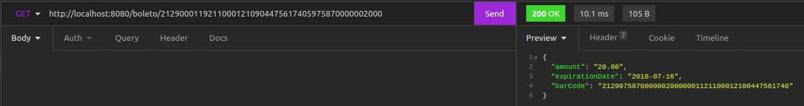

# Boletos bancários e de concessionárias

## Sobre

> Esse app faz validações em cima de códigos de barras de boletos bancários e de concessionárias.
> Basicamente, você irá fazer uma requisição para a rota '/boleto/:typeableLine', passando como variável uma
> linha digitável de um boleto bancário ou de concessionária. O app irá validar os dígitos verificáveis e o dígito
> verificável geral do código de barras, além de validar outras coisas, como por exemplo se o que você passou como > variável da requisição realmente é uma linha digitável.

> 

---

## Iniciando com a aplicação

- Clone esse repositório (ssh nesse exemplo): `$git clone git@github.com:Murilo-Rainho/bank-slip-and-dealer-slip.git`

- Entre no diretório local que acabou de ser criado: `$cd bank-slip-and-dealer-slip`

- Instale as dependencias: `$npm i`

- Crie um arquivo `.env` e configure a variável de ambiente para rodar o servidor:
> ```
> PORT=8080
> ```

- E, finalmente, rode o comando `$npm start` para inicializar o servidor.

---

## Desenvolvimento

> Durante o desenvolvimento dessa aplicação, o maior desafio foi interpretar as regras de negócio. Para entendê-las,
> foi dado dois arquivos, um referente a cada tipo de boleto (bancário e concessionária). Apesar de serem arquivos
> pequenos, se tratava de um assunto que eu nunca havia estudado antes. O que cada algarismo do código de barras
> representa, tipos diferentes de boletos, o que é uma linha digitável, dígitos verificadores... Tudo isso foi
> sendo entendido ao longo dos 4 dias que me foi proposto para desenvolver esta aplicação. Outra condição era
> desenvolver sem o auxílio de bibliotecas de validações. Não foi difícil, mas acabou me tomando um pouco mais
> de tempo. Devido à alguns problemas de testes no início e o tempo, o TDD só foi aplicado à partir da metade do
> desenvolvimento. Entretanto, apesar desses pequenos problemas, tudo o que foi desenvolvido (ainda que não esteja acabado) foi testado, comentado e feito com um código legível (não direi código limpo pois ainda não terminei de ler o livro).

---

## Ferramentas utilizadas

- Um pouco de API RESTful com express.js;
- Arquitetura de camadas MSC;
- Eslint;
- Testes unitários e de integração (mocha, chai, sinon, sinon-chai e chai-http);
- Validações sem bibliotecas externas.

---

## O que já foi desenvolvido

- [x] Validações para os boletos bancários;
  - [x] Verificar se foi passado uma linha digitável correta;
  - [x] Validar os dígitos verificáveis (módulo 10);
  - [x] validar o dígito verificável geral do código de barras (módulo 11);
- [x] Validações para os boletos de concessionárias;
  - [x] Verificar se foi passado uma linha digitável correta;
  - [x] Validar os dígitos verificáveis (módulo 10);
  - [x] validar o dígito verificável geral do código de barras (módulo 11);
- [x] Testes unitários;
- [x] Testes de integração;

---
